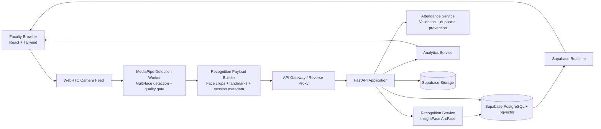
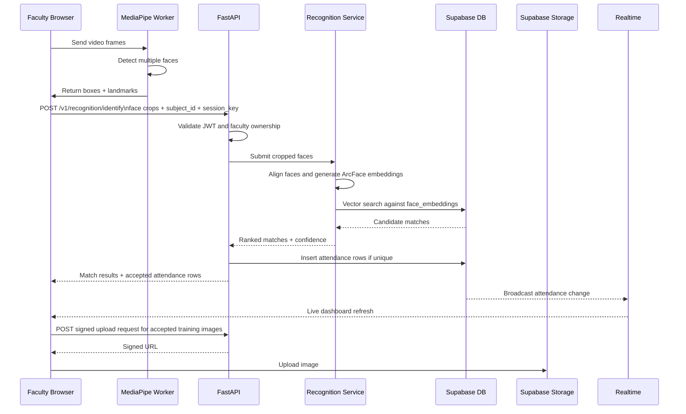

# Phase 1 System Design

## Objective

This document defines the production architecture for the AI attendance platform before implementation begins. It locks the system boundaries, core workflows, data ownership, and the runtime split between browser-side detection and backend-side recognition.

## Confirmed Stack

- Face detection: MediaPipe in the browser
- Face recognition: ArcFace via InsightFace
- Backend API: FastAPI
- Database: Supabase PostgreSQL with pgvector
- Storage: Supabase Storage
- Frontend: React + Tailwind
- Analytics: Supabase + Chart.js
- Authentication: Supabase Auth

## Architecture Principles

1. Detection runs on the client to reduce bandwidth and improve responsiveness.
2. Recognition and attendance writes run on the server to protect model integrity and business rules.
3. Supabase Auth remains the single identity source; the backend never stores passwords.
4. Attendance writes are transactional and idempotent.
5. Face embeddings are stored separately from student profiles and are versioned by model.
6. Every production path is multi-tenant aware by department, role, and subject ownership.

## High-Level Architecture

## Component Responsibilities

### Frontend

- Handles login through Supabase Auth.
- Captures camera input via WebRTC.
- Runs MediaPipe in a worker so face detection does not block the UI thread.
- Displays face boxes, match labels, confidence status, and attendance events in real time.
- Calls FastAPI for protected business operations.

### API Gateway

- Terminates TLS.
- Routes `/api/*` traffic to FastAPI.
- Applies coarse rate limiting and request size limits.
- Adds request IDs for tracing.

### FastAPI Backend

- Verifies Supabase JWTs.
- Enforces role-based authorization and subject ownership rules.
- Accepts registration, subject assignment, attendance, reporting, and analytics requests.
- Coordinates with the recognition service.
- Persists attendance and student metadata.

### Recognition Service

- Performs face alignment using submitted landmarks.
- Generates ArcFace embeddings.
- Queries pgvector for nearest-neighbor candidates.
- Applies confidence thresholds and returns ranked matches.
- Never exposes raw embedding search directly to the browser.

### Supabase PostgreSQL + pgvector

- Stores application entities, attendance events, and vector embeddings.
- Supports similarity search for embeddings.
- Publishes realtime updates for dashboards.

### Supabase Storage

- Stores original registration images and curated training assets.
- Uses private buckets with signed upload and download URLs.

## Multi-Face Attendance Design

The attendance flow must support multiple students in one frame without uploading continuous raw video to the server.

### Runtime Flow

1. Faculty selects subject, section, and session in the browser.
2. Browser opens the camera and samples frames at a controlled rate.
3. MediaPipe detects all visible faces in the frame.
4. A browser quality gate rejects faces that are too small, blurry, or heavily occluded.
5. The browser sends a batched request containing cropped faces, landmarks, and session metadata.
6. FastAPI validates the faculty token and verifies that the subject belongs to the faculty.
7. InsightFace generates an embedding for each crop.
8. pgvector returns nearest embedding candidates.
9. The backend applies thresholding, tie-break rules, and anti-duplicate attendance checks.
10. Valid matches are inserted into attendance in one transaction.
11. Supabase Realtime pushes the updated attendance state back to dashboards.

### Why Detection Stays In The Browser

- Lower latency for bounding boxes and user feedback.
- Lower bandwidth because only face crops and metadata are uploaded.
- Better privacy because full video streams are not persisted.
- Better scalability because the server only processes candidate faces, not all frames.

### Why Recognition Stays On The Server

- Embedding models and thresholds remain controlled.
- Duplicate prevention and subject validation remain authoritative.
- Audit logs remain complete.
- Threshold and model upgrades are centralized.

## Attendance Sequence

## Role Model

| Role | Scope | Core Capabilities |
| --- | --- | --- |
| Admin | Global | Create departments, assign HODs, manage faculty, view institution analytics, manage configuration |
| HOD | Department | All faculty capabilities plus department analytics, department reports, subject assignment, faculty oversight |
| Faculty | Assigned subjects | View assigned subjects, register students, capture face samples, mark attendance, view subject reports |

The HOD role is a superset of faculty permissions inside the same department. A HOD may also have a faculty profile if they teach subjects.

## Core Workflows

### 1. Student Registration

1. Faculty opens the registration screen.
2. Faculty enters student metadata: name, roll number, department, semester, section.
3. Browser captures multiple face samples.
4. Each sample is uploaded to private storage through signed URLs.
5. Backend generates embeddings for accepted samples.
6. Embeddings are saved in `face_embeddings`; the student profile stores only canonical profile metadata.

### 2. Faculty Subject Assignment

1. Admin or HOD creates a subject for a department, semester, and section.
2. HOD assigns the subject to a faculty profile.
3. The backend enforces same-department assignment.
4. Faculty dashboards show only assigned subjects.

### 3. Face Recognition Attendance

1. Faculty selects a subject and active session.
2. Browser detects all faces in frame.
3. Server identifies candidates and returns confidence-scored matches.
4. Backend writes attendance only for unique student-subject-date-session combinations.
5. Browser receives accepted, duplicate, rejected, and low-confidence statuses per face.

### 4. Analytics Dashboard

1. Dashboard queries aggregate attendance metrics from FastAPI.
2. FastAPI computes department-safe aggregates from PostgreSQL.
3. Charts update in real time via Supabase Realtime subscriptions.

### 5. Report Generation

1. Faculty or HOD selects a report type and date range.
2. Backend validates the scope against the user role.
3. Export jobs produce CSV, Excel, or PDF.
4. Generated reports are delivered by signed download URLs.

## Data Model Decisions

1. `public.users` mirrors `auth.users` and stores application role and department context.
2. `students` stores student identity and academic placement, not embeddings.
3. `face_embeddings` stores versioned ArcFace vectors and image-quality metadata.
4. `attendance` includes `session_key` so multiple same-day classes for one subject do not collide.
5. `subjects` carry semester and section ownership so faculty attendance is bounded to a cohort.

## Non-Functional Requirements

- Availability: stateless backend API with horizontally scalable recognition workers.
- Performance: browser-side detection, batched face inference, vector index on active embeddings.
- Auditability: every attendance row includes actor, timestamp, confidence score, and metadata.
- Security: JWT auth, RBAC, RLS, signed storage access, and rate limiting.
- Privacy: do not persist continuous video streams; only approved face images and derived embeddings are stored.

## Phase 1 Exit Criteria Mapping

- All system flows documented: satisfied by this file and the API and security documents.
- Database schema finalized: see `database/schema.sql`.
- API endpoints defined: see `docs/api-spec.md`.
- Security model defined: see `docs/security-model.md`.